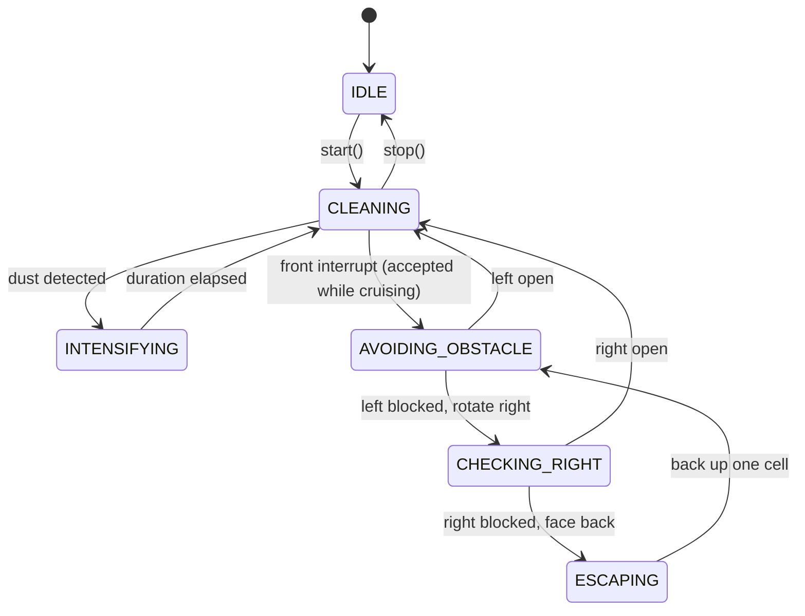

# Design Model

## Design Change Trace - 2026-06-04

### [변경]
- `RvcController::onFrontObstacleDetected()`가 `bool`을 반환하며 interrupt 수용 정책을 소유하도록 변경한다. 정상 주행(`CLEANING` / `INTENSIFYING`) 중이면 motor를 STOP하고 `AVOIDING_OBSTACLE`로 전이한 뒤 `true`를 반환하고, 회피 시퀀스(`AVOIDING_OBSTACLE` / `CHECKING_RIGHT` / `ESCAPING`) 중이면 아무것도 하지 않고 `false`를 반환한다. simulator는 반환이 `false`면 `onTick()`으로 폴백하므로 Right Scan을 위한 우회전이 만드는 거짓 interrupt가 `CHECKING_RIGHT` 평가를 가로채지 못한다. controller가 정책을 소유하므로 `state()` getter는 추가하지 않는다(AD-05 / F-02 준수). (F-10 참조)

### [추가]
- mermaid State diagram 추가

---

## Design Change Trace - 2026-06-01

### [추가]
- FrontSensor 기반 오른쪽 probe를 명시적으로 표현하는 `CHECKING_RIGHT` 상태를 추가한다.
- interrupt는 정지만 수행하고, 이후 tick에서 좌측 확인, 우측 probe, escape를 진행하는 multi-tick 흐름을 추가한다.

### [삭제]
- 활성 `RvcController` 의존성에서 전용 `RightSensor`를 삭제한다.
- `SensorData::is_right_blocked`, `_escape_step`, `continueEscaping()`을 활성 설계에서 삭제한다.

### [변경]
- Right Scan을 `SensorData` 값이 아니라 controller 상태 흐름으로 변경한다.
- ESCAPING을 고정 step counter 방식에서 후진 후 재평가하는 명시 상태머신 방식으로 변경한다.

---

## 1. 설계 원칙

- **SRP**: sensor 읽기, navigation 결정, actuator 명령, simulator 책임을 분리한다.
- **OCP**: navigation strategy는 controller client 수정 없이 교체 가능해야 한다.
- **DIP**: `RvcController`는 concrete HAL이 아니라 interface에 의존한다.
- **Testability**: right probe와 escape는 motor log 및 simulator position으로 관찰 가능해야 한다.

---

## 2. 주요 enum

```cpp
enum class Direction  { FORWARD, BACKWARD, LEFT, RIGHT, STOP };
enum class CleanPower { OFF, ON, POWER_UP };

enum class RvcState {
    IDLE,
    CLEANING,
    AVOIDING_OBSTACLE,
    CHECKING_RIGHT,
    ESCAPING,
    INTENSIFYING
};
```

---

## 3. 주요 interface

| Interface | 책임 |
|---|---|
| `ISensor` | `detect()`로 boolean sensor 값을 반환한다. |
| `IMotorController` | `move(Direction)`으로 이동 명령을 수행한다. |
| `ICleanerController` | `setPower(CleanPower)`로 청소 장치를 제어한다. |
| `INavigationStrategy` | `SensorData`를 바탕으로 다음 navigation 신호를 결정한다. |

활성 sensor 의존성은 `FrontSensor`, `LeftSensor`, `DustSensor`이다. 전용 `RightSensor`는 활성 의존성이 아니다.

---

## 4. SensorData

`SensorData`는 `DefaultNavigationStrategy`가 필요한 sensor 사실만 담는다.

```cpp
struct SensorData {
    bool is_front_blocked = false;
    bool is_left_blocked  = false;
    bool has_dust         = false;
};
```

오른쪽 정보는 `SensorData`에 저장하지 않는다. robot이 오른쪽으로 회전한 뒤 `CHECKING_RIGHT` 상태에서 `FrontSensor`로 확인한다.

---

## 5. RvcController 책임

`RvcController`는 다음을 orchestration한다.

- start/stop lifecycle
- timer tick 처리
- front obstacle interrupt 처리
- `AVOIDING_OBSTACLE -> CHECKING_RIGHT -> ESCAPING` 상태 진행
- cleaner power-up duration 관리

`onFrontObstacleDetected()`는 `bool`을 반환하며 interrupt 수용 정책을 소유한다. 정상 주행(`CLEANING` / `INTENSIFYING`) 중일 때만 interrupt를 수용하고(STOP, `AVOIDING_OBSTACLE`로 전이, `true` 반환), 회피 시퀀스 중에는 `false`를 반환한다. simulator는 controller 상태를 직접 판단하지 않고, 반환이 `false`면 `onTick()`으로 폴백할 뿐이다. controller가 정책을 소유하므로 `state()` getter는 노출하지 않는다(AD-05 / F-02 준수). (F-10 참조)

---

## 6. Right Scan 흐름

Right Scan은 상태머신 안에서 명시적으로 진행된다.

front obstacle interrupt는 controller가 정상 주행(`CLEANING` / `INTENSIFYING`)일 때만 수용된다. `onFrontObstacleDetected()`가 회피 시퀀스 중에는 `false`를 반환하기 때문이다. 회피 시퀀스 중에는 Right Scan을 위한 우회전으로 새 정면이 벽이 되어 rising edge가 생기더라도 이를 interrupt로 보지 않고, simulator가 `onTick()`으로 폴백하여 `CHECKING_RIGHT`에서 평가한다. (F-10 참조)

```text
front obstacle interrupt   (CLEANING / INTENSIFYING 일 때만)
  -> STOP
  -> state = AVOIDING_OBSTACLE

next tick
  -> LeftSensor 확인
  -> left open: LEFT, then CLEANING
  -> left blocked: RIGHT, then CHECKING_RIGHT

next tick in CHECKING_RIGHT
  -> FrontSensor가 기존 오른쪽 방향을 바라봄
  -> right open: CLEANING, 다음 cleaning tick에서 FORWARD
  -> right blocked: LEFT로 원래 heading 복구, then ESCAPING
```

---

## 7. ESCAPING 흐름

`ESCAPING`은 한 tick에 `BACKWARD` 하나만 발행하고, 이후 `AVOIDING_OBSTACLE`로 돌아가 주변을 다시 판단한다.

```text
ESCAPING tick
  -> BACKWARD
  -> state = AVOIDING_OBSTACLE
```

이 구조는 dead-end 상황에서 여러 tick에 걸쳐 후진할 수 있게 하며, 한 tick에 한 칸 이하 이동을 보장한다.

---

## 상태 머신 다이어그램



회피 시퀀스(`AVOIDING_OBSTACLE` / `CHECKING_RIGHT` / `ESCAPING`) 중에는 front interrupt가 무시된다(`onFrontObstacleDetected()`가 false 반환) — Right Scan용 회전이 만든 거짓 interrupt를 차단한다. (F-10 참조)
