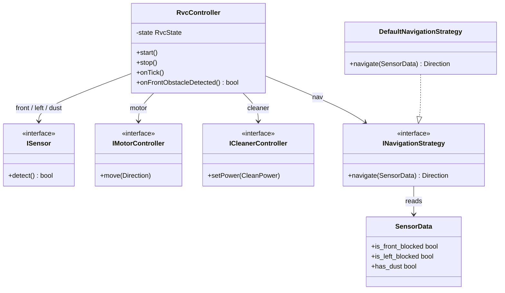

# Domain Model

## Design Change Trace - 2026-06-04

### [변경]
- `RvcController::onFrontObstacleDetected()` returns `bool` and owns the interrupt-acceptance policy in the class structure: it accepts the interrupt only while cruising (`CLEANING` / `INTENSIFYING`) and returns `false` during the avoidance sequence, on which the Simulator falls back to `onTick()`. No `state(): RvcState` getter is added — the controller owns the policy (AD-05 / F-02 준수). (F-10 참조)

### [추가]
- mermaid Class diagram 추가

---

## Design Change Trace - 2026-05-29

### [추가]
- Added `RightScan` as a domain concept for right-side obstacle detection.

### [삭제]
- Removed active `RightSensor` participation from the current domain model.

### [변경]
- Changed `Surrounded State` to depend on Front Sensor, Left Sensor, and Right Scan.

The Domain Model identifies the key conceptual classes in the RVC problem domain, their attributes, and their relationships. These are not software classes — they represent real-world concepts.

---

## 1. Conceptual Classes

| Class | Description |
|---|---|
| **RVC** | The robot vacuum cleaner. The central entity that navigates and cleans. |
| **CleaningSession** | A single run from start to stop. Tracks duration and state. |
| **Sensor** | Abstract concept for any input device on the RVC that detects environment state. |
| **FrontSensor** | Interrupt-driven sensor detecting obstacles directly ahead. |
| **LeftSensor** | Periodic sensor detecting obstacles on the left side. |
| **RightScan** | Right-side obstacle check performed by turning right, sampling the FrontSensor, and restoring heading. |
| **DustSensor** | Periodic sensor detecting dust on the floor surface. |
| **Obstacle** | A physical object that blocks the RVC's path. Detected by Front/Left/Right sensors. |
| **Dust** | Particulate matter on the floor surface. Detected by the DustSensor. |
| **Motor** | Drives the physical movement of the RVC. Receives direction commands. |
| **Cleaner** | The vacuum/mop mechanism. Receives power-level commands. |
| **Timer** | Digital clock that generates periodic Tick signals to drive the control loop. |
| **DirectionCommand** | A command to the Motor: Forward, Backward, Left (turn), Right (turn), Stop. |
| **CleaningCommand** | A command to the Cleaner: Off, On, Power Up. |

---

## 2. Attributes

| Class | Attributes |
|---|---|
| CleaningSession | state {Idle, Active, Stopped} |
| FrontSensor | is_triggered : bool |
| LeftSensor | is_blocked : bool |
| RightScan | is_blocked : bool |
| DustSensor | has_dust : bool |
| DirectionCommand | value {Forward, Backward, Left, Right, Stop} |
| CleaningCommand | value {Off, On, PowerUp} |
| Timer | tick_interval : duration |

---

## 3. Associations

```
RVC ──────────────── conducts ────────────────> CleaningSession
RVC ──────────────── has ──────────────────1──> FrontSensor
RVC ──────────────── has ──────────────────1──> LeftSensor
RVC ──────────────── performs ─────────────1──> RightScan
RVC ──────────────── has ──────────────────1──> DustSensor
RVC ──────────────── driven by ────────────1──> Timer
RVC ──────────────── commands ─────────────1──> Motor          (via DirectionCommand)
RVC ──────────────── commands ─────────────1──> Cleaner        (via CleaningCommand)

FrontSensor ──────── detects ──────────────*──> Obstacle       (interrupt)
LeftSensor ───────── detects ──────────────*──> Obstacle       (periodic)
RightScan ────────── detects ──────────────*──> Obstacle       (front-sensor scan)
DustSensor ───────── detects ──────────────*──> Dust           (periodic)

FrontSensor ─────────────────┐
LeftSensor ──────────────────┤──── generalize ──────────────── Sensor
DustSensor ──────────────────┘
```

---

## 4. Key Domain Rules

- A CleaningSession is Active only while both Motor and Cleaner are operating.
- The RVC issues exactly one DirectionCommand and one CleaningCommand at any point in time.
- FrontSensor triggers asynchronously (interrupt); all other sensors are read synchronously per Tick.
- An Obstacle on all three sides (Front + Left + Right) defines the **Surrounded State**, which requires backward movement before turning.
- Dust detection during active cleaning raises CleaningCommand to PowerUp temporarily; it does not stop navigation.
- The FrontSensor interrupt is only meaningful while the RVC is cruising. In the software model, `RvcController::onFrontObstacleDetected()` returns `bool` and owns this policy: it accepts the interrupt only while cruising and returns `false` during the avoidance sequence, on which the Simulator falls back to `onTick()`. Because the controller owns the policy, no `state(): RvcState` getter is exposed (so the right-turn used for RightScan does not register as a new front obstacle). (AD-05 / F-02 준수, F-10 참조)

---

## Class Diagram



`RvcController` depends only on interfaces (dependency injection); there is no right-only sensor and no `state()` getter (AD-05 / F-02 compliant). Interrupt acceptance is owned by `onFrontObstacleDetected(): bool`.
