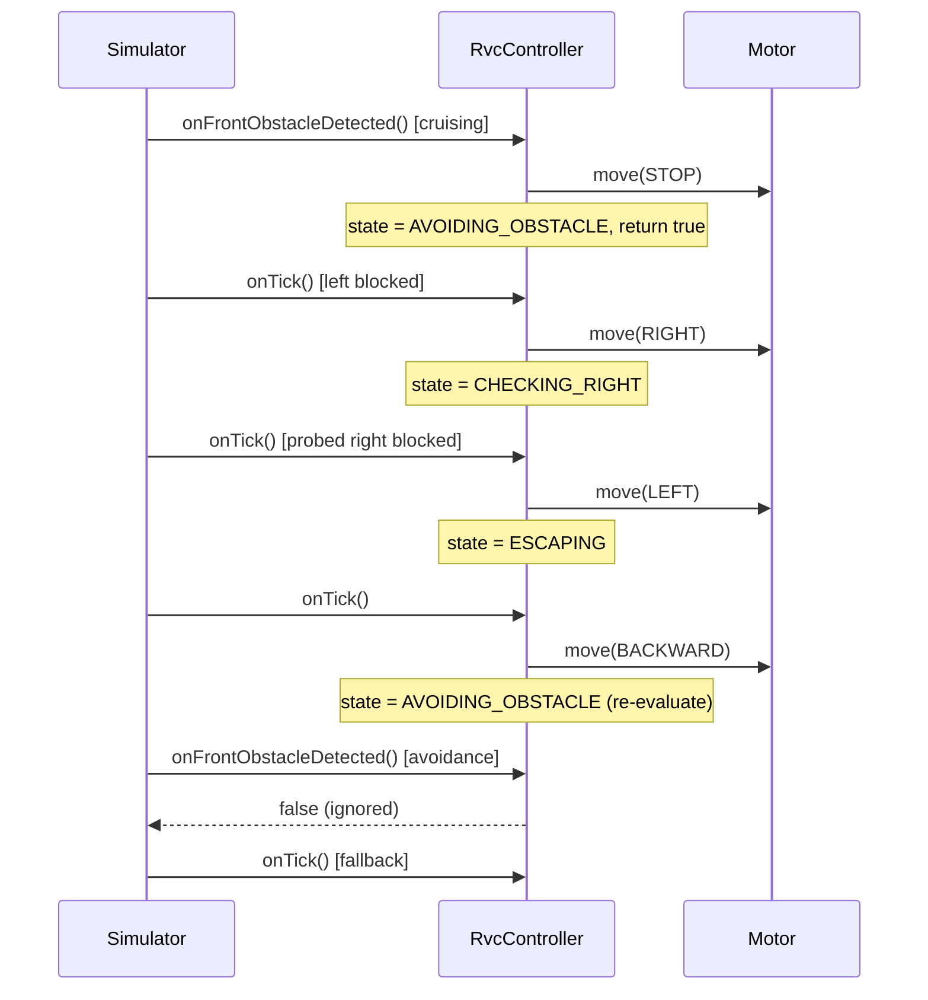

# SW Architecture Document

## Design Change Trace - 2026-06-04

### [추가]
- mermaid 시퀀스 다이어그램 추가

### [변경]
- interrupt 수용 정책을 controller가 소유하도록 변경한다. `onFrontObstacleDetected()`가 `bool`을 반환하며 전이를 스스로 가드한다. `CLEANING` / `INTENSIFYING` 중에만 interrupt를 수용하고(STOP, `AVOIDING_OBSTACLE`로 전이, `true` 반환), `AVOIDING_OBSTACLE` / `CHECKING_RIGHT` / `ESCAPING` 중에는 `false`를 반환한다. simulator는 front rising edge에서 `onFrontObstacleDetected()`를 호출하고 반환이 `false`면 `onTick()`으로 폴백하므로 Right Scan의 우회전이 거짓 interrupt를 만들지 못한다. controller가 정책을 소유하므로 `state()` getter는 추가하지 않는다(AD-05 / F-02 준수). (F-10 참조)

---

## Design Change Trace - 2026-06-01

### [추가]
- application state machine에 `CHECKING_RIGHT`를 추가한다.
- simulator의 front interrupt를 edge-trigger 방식으로 처리한다.

### [삭제]
- 활성 `RightSensor` build 및 controller 의존성을 삭제한다.
- `_escape_step` 기반 escape orchestration을 활성 architecture에서 삭제한다.

### [변경]
- 오른쪽 감지를 오른쪽 회전 후 `FrontSensor`를 읽는 multi-tick controller 흐름으로 변경한다.
- 포위 상태 escape를 한 칸 후진 후 다시 side evaluation으로 돌아가는 방식으로 변경한다.

---

## 1. 개요

RVC Control SW는 계층형 architecture를 따른다. application logic은 concrete hardware class가 아니라 interface와 domain type에 의존한다.

---

## 2. 계층 구조

```text
Application Layer
  - RvcController
  - main

Domain Layer
  - DefaultNavigationStrategy
  - SensorData
  - Direction / CleanPower / RvcState

Interface Layer
  - ISensor
  - IMotorController
  - ICleanerController
  - INavigationStrategy

HAL / Simulator / UI Layer
  - FrontSensor, LeftSensor, DustSensor
  - Simulator, SimulatedSensor, SimulatedMotor, SimulatedCleaner
  - ConsoleDisplay, GridDisplay
```

---

## 3. 핵심 의존성

- `RvcController`는 모든 의존성을 constructor injection으로 받는다.
- `RightSensor.cpp`는 active CMake source list에서 제외한다.
- 오른쪽은 오른쪽 회전 후 `CHECKING_RIGHT` 상태에서 `FrontSensor`로 확인한다.
- simulator는 robot의 현재 heading 기준으로 front reading을 주입하므로, 오른쪽 회전 후 front sensor는 기존 오른쪽 방향을 의미한다.

---

## 4. 장애물 처리 흐름

```text
Front obstacle rising edge
  -> RvcController::onFrontObstacleDetected()
  -> STOP
  -> state = AVOIDING_OBSTACLE

Timer tick in AVOIDING_OBSTACLE
  -> LeftSensor 확인
  -> left open이면 LEFT
  -> left blocked이면 RIGHT 후 state = CHECKING_RIGHT

Timer tick in CHECKING_RIGHT
  -> FrontSensor를 right-side probe로 읽음
  -> open이면 CLEANING
  -> blocked이면 LEFT 후 state = ESCAPING

Timer tick in ESCAPING
  -> BACKWARD
  -> state = AVOIDING_OBSTACLE
```

---

## 5. Simulator 통합

- front obstacle interrupt는 edge-trigger 방식이며, 수용 정책은 controller가 소유한다. simulator는 rising edge에서 `onFrontObstacleDetected()`를 호출하고, 이 함수는 controller가 `CLEANING` / `INTENSIFYING`일 때만 `true`를, `AVOIDING_OBSTACLE` / `CHECKING_RIGHT` / `ESCAPING` 중에는 `false`를 반환한다. 반환이 `false`(처리 안 됨)면 simulator는 `onTick()`으로 폴백한다. 이로써 회피 시퀀스 중 Right Scan을 위한 우회전이 만드는 거짓 interrupt가 오른쪽 평가를 가로채지 못한다. simulator는 controller 상태를 읽지 않으며 `state()` getter는 존재하지 않는다(AD-05 / F-02 준수). (F-10 참조)

```cpp
// RvcController — interrupt 수용 정책을 소유
bool RvcController::onFrontObstacleDetected() {
    if (_state != RvcState::CLEANING && _state != RvcState::INTENSIFYING) {
        return false;          // 회피 시퀀스 중엔 무시
    }
    _motor->move(Direction::STOP);
    _state = RvcState::AVOIDING_OBSTACLE;
    return true;
}
// Simulator::tick() — 처리 안 되면 onTick으로 폴백
bool handled = false;
if (front_blocked && !_prev_front_blocked) {
    handled = _controller.onFrontObstacleDetected();
}
if (!handled) { _controller.onTick(); }
```
- front가 계속 blocked인 동안에는 이후 동작을 `onTick()`으로 진행한다.
- `applyPendingMotorCommands()`는 새로 발행된 명령만 순서대로 반영하며, 테스트는 한 tick에 한 칸 초과 이동하지 않음을 검증한다.

---

## 시퀀스 다이어그램 — 회피·탈출



회피 시퀀스 중 Right Scan용 우회전이 만든 거짓 interrupt는 `false`로 무시되고 `onTick()` 폴백으로 처리된다. 그래서 `CHECKING_RIGHT` 평가가 가로채이지 않고 후진 연쇄가 유지된다(failure F-10 참조).

---

## 6. 빌드 구조

- `rvc_core`는 main을 제외한 production code를 포함한다.
- `hal/RightSensor.cpp`는 repository에 inactive legacy code로 남지만 compile하지 않는다.
- MSVC에서는 한국어 trace comment를 안정적으로 처리하기 위해 `/utf-8`을 사용한다.
- `rvc_tests`는 domain, controller, simulator behavior를 검증한다.
