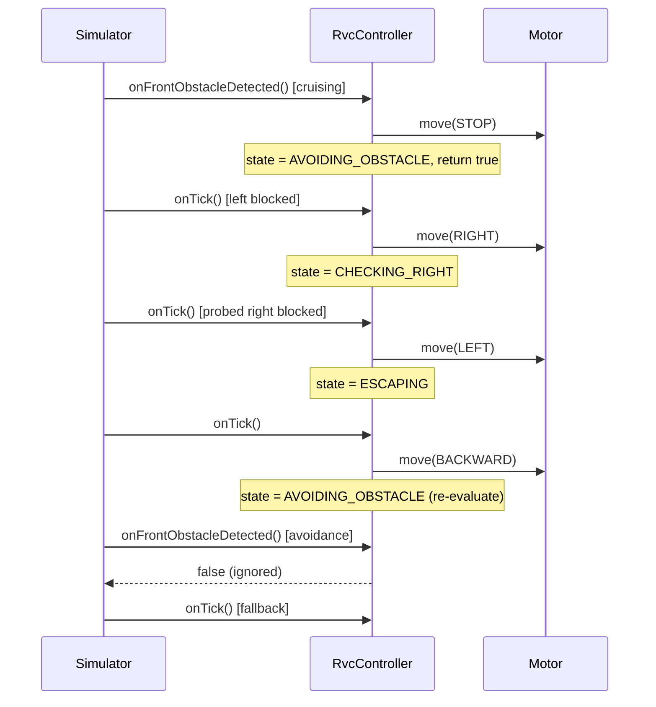

# SW Architecture Document

## Design Change Trace - 2026-06-04

### [추가]
- mermaid 시퀀스 다이어그램 추가

### [변경]
- The interrupt-acceptance policy now lives in the controller: `onFrontObstacleDetected()` returns `bool` and guards the transition itself — it accepts the interrupt (STOP, transition to `AVOIDING_OBSTACLE`, return `true`) only while in `CLEANING` / `INTENSIFYING`, and returns `false` during `AVOIDING_OBSTACLE` / `CHECKING_RIGHT` / `ESCAPING`. On a front rising edge the simulator calls `onFrontObstacleDetected()` and falls back to `onTick()` when it returns `false`, so the Right Scan right-turn cannot raise a false interrupt. No `state()` getter is added — the controller owns the policy (AD-05 / F-02 준수). (F-10 참조)

---

## Design Change Trace - 2026-06-01

### [추가]
- Added `CHECKING_RIGHT` to the application state machine.
- Added edge-triggered simulator front interrupt handling.

### [삭제]
- Removed active `RightSensor` build and controller dependency.
- Removed `_escape_step` based escape orchestration from the active architecture.

### [변경]
- Changed right-side detection to a multi-tick controller flow using `FrontSensor` after a right turn.
- Changed surrounded escape to back up one cell, then re-enter side evaluation.

---

## 1. Overview

RVC Control SW follows a layered architecture. Application logic depends on interfaces and domain types, not concrete hardware classes.

---

## 2. Layers

```text
Application Layer
  - RvcController
  - main

Domain Layer
  - DefaultNavigationStrategy
  - SensorData
  - Direction / CleanPower / RvcState

Interface Layer
  - ISensor
  - IMotorController
  - ICleanerController
  - INavigationStrategy

HAL / Simulator / UI Layer
  - FrontSensor, LeftSensor, DustSensor
  - Simulator, SimulatedSensor, SimulatedMotor, SimulatedCleaner
  - ConsoleDisplay, GridDisplay
```

---

## 3. Key Dependencies

- `RvcController` receives all dependencies through constructor injection.
- `RightSensor.cpp` is excluded from the active CMake source list.
- The right side is checked by rotating right and reading `FrontSensor` in `CHECKING_RIGHT`.
- The simulator feeds front readings according to the robot's current heading, so after a right turn the front sensor represents the old right side.

---

## 4. Obstacle Flow

```text
Front obstacle rising edge
  -> RvcController::onFrontObstacleDetected()
  -> STOP
  -> state = AVOIDING_OBSTACLE

Timer tick in AVOIDING_OBSTACLE
  -> read LeftSensor
  -> LEFT if left is open
  -> RIGHT and state = CHECKING_RIGHT if left is blocked

Timer tick in CHECKING_RIGHT
  -> read FrontSensor as right-side probe
  -> CLEANING if open
  -> LEFT and state = ESCAPING if blocked

Timer tick in ESCAPING
  -> BACKWARD
  -> state = AVOIDING_OBSTACLE
```

---

## 5. Simulator Integration

- Front obstacle interrupt is edge-triggered, and the acceptance policy is owned by the controller. On a rising edge the simulator calls `onFrontObstacleDetected()`, which returns `true` only while the controller is in `CLEANING` / `INTENSIFYING` and `false` during `AVOIDING_OBSTACLE` / `CHECKING_RIGHT` / `ESCAPING`. When the call returns `false` (not handled) the simulator falls back to `onTick()`. This prevents the right-turn performed for Right Scan during the avoidance sequence from producing a false interrupt that hijacks the right-side evaluation. The simulator does not read controller state — no `state()` getter exists (AD-05 / F-02 준수). (F-10 참조)

```cpp
// RvcController — owns the interrupt-acceptance policy
bool RvcController::onFrontObstacleDetected() {
    if (_state != RvcState::CLEANING && _state != RvcState::INTENSIFYING) {
        return false;          // ignored during the avoidance sequence
    }
    _motor->move(Direction::STOP);
    _state = RvcState::AVOIDING_OBSTACLE;
    return true;
}
// Simulator::tick() — fall back to onTick() when not handled
bool handled = false;
if (front_blocked && !_prev_front_blocked) {
    handled = _controller.onFrontObstacleDetected();
}
if (!handled) { _controller.onTick(); }
```
- While front remains blocked, later behavior progresses through `onTick()`.
- `applyPendingMotorCommands()` applies each newly emitted command in order, and tests verify no tick moves more than one cell.

---

## Sequence Diagram — Avoidance & Escape



During the avoidance sequence, the false interrupt raised by the Right Scan right-turn is ignored as `false` and handled by the `onTick()` fallback. This keeps the `CHECKING_RIGHT` evaluation from being hijacked and preserves the back-up chain (see failure F-10).

---

## 6. Build Structure

- `rvc_core` contains all non-main production code.
- `hal/RightSensor.cpp` remains in the repository as inactive legacy code but is not compiled.
- MSVC uses `/utf-8` so Korean trace comments compile cleanly.
- `rvc_tests` covers domain, controller, and simulator behavior.
