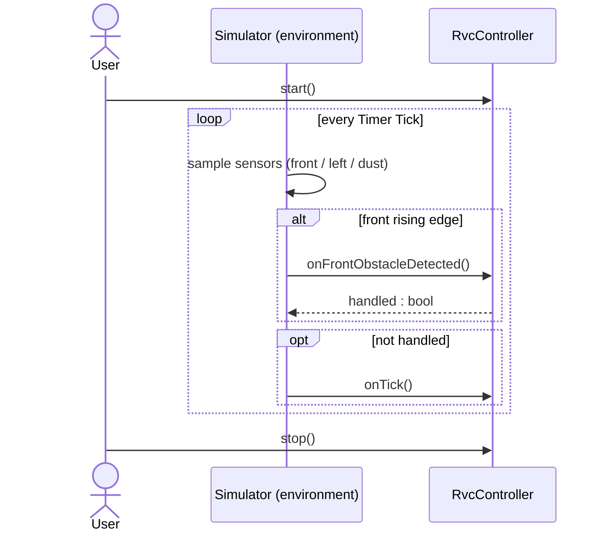

# System Operation Interface

## SRS Change Trace - 2026-06-04

### [추가]
- mermaid 시퀀스 다이어그램 추가

### [변경]
- `onFrontObstacleDetected()`를 controller 상태로 게이트한다. 정상 주행(`CLEANING`/`INTENSIFYING`) 중에만 동작하고 회피 시퀀스(`AVOIDING_OBSTACLE`, `CHECKING_RIGHT`, `ESCAPING`) 중에는 억제하여, right scan 회전이 거짓 interrupt로 `CHECKING_RIGHT`를 가로채지 못하도록 한다(failure F-10 참조).
- simulator 계약을 보완한다. front obstacle interrupt는 clear→blocked edge에서, 그리고 controller가 정상 주행(`CLEANING`/`INTENSIFYING`) 중일 때만 발생한다(failure F-10 참조).

## SRS Change Trace - 2026-06-01

### [추가]
- 시스템에서 관찰 가능한 오른쪽 probe 단계로 `CHECKING_RIGHT`를 추가한다.
- simulator 계약에 front obstacle edge-trigger 처리를 추가한다.

### [삭제]
- 시스템 operation interface에서 Right Sensor polling을 삭제한다.
- `onFrontObstacleDetected()`가 모든 side sensor를 즉시 읽는다는 가정을 삭제한다.

### [변경]
- `onFrontObstacleDetected()`는 `STOP`만 발행하고, side evaluation은 이후 `tick()`으로 미루도록 변경한다.
- ESCAPING은 tick마다 `BACKWARD`를 발행한 뒤 다시 side evaluation으로 돌아가도록 변경한다.

---

## 1. 요약

| Operation | Trigger Actor | 관련 UC |
|---|---|---|
| `startCleaning()` | User | UC-01 |
| `tick()` | Timer | UC-02, UC-03, UC-04, UC-05 |
| `onFrontObstacleDetected()` | Front Sensor | UC-03, UC-04 |
| `stopCleaning()` | User | UC-06 |

---

## 2. System Operations

### SO-01: `startCleaning()`

RVC를 `IDLE`에서 `CLEANING`으로 전환하고, cleaner를 `ON`으로 설정하며, motor에 `FORWARD`를 명령한다.

### SO-02: `tick()`

활성 상태의 주기 동작을 진행한다.

| 현재 상태 | 주요 작업 | 가능한 출력 |
|---|---|---|
| `CLEANING` | dust 확인, 일반 이동 | `FORWARD`, 필요 시 `POWER_UP` |
| `INTENSIFYING` | power-up duration countdown | duration 종료 시 `ON` |
| `AVOIDING_OBSTACLE` | Left Sensor를 읽고 좌회전 또는 오른쪽 probe 결정 | `LEFT` 또는 `RIGHT` |
| `CHECKING_RIGHT` | 기존 오른쪽 방향을 바라보는 상태에서 Front Sensor 확인 | blocked면 `LEFT`, open이면 cleaning 복귀 |
| `ESCAPING` | 한 칸 후진 후 재평가 | `BACKWARD` |

### SO-03: `onFrontObstacleDetected()`

Front Sensor가 보내는 interrupt 기반 전방 장애물 알림이다.

계약:
- 시스템이 idle이면 아무 것도 하지 않는다.
- [변경] 정상 주행(`CLEANING`/`INTENSIFYING`) 중에만 동작하고, 회피 시퀀스(`AVOIDING_OBSTACLE`, `CHECKING_RIGHT`, `ESCAPING`) 중에는 interrupt를 억제한다. 회피 중에는 Front Sensor가 right scan에 재사용되어 회전이 거짓 interrupt를 일으켜 `CHECKING_RIGHT`를 가로챌 수 있기 때문이다(failure F-10 참조). 억제될 때 side evaluation은 `tick()`으로 계속 진행한다.
- 그 외 상태에서는 `STOP`을 발행한다.
- 상태를 `AVOIDING_OBSTACLE`로 설정한다.
- interrupt handler 안에서 Right Scan을 수행하지 않는다. 오른쪽 probe는 이후 `tick()` 호출로 진행한다.

### SO-04: `stopCleaning()`

RVC를 `IDLE`로 전환하고, motor에 `STOP`, cleaner에 `OFF`를 명령한다.

---

## 3. Right Probe Sequence

```text
onFrontObstacleDetected()
  -> STOP
  -> AVOIDING_OBSTACLE

tick()
  -> left open이면 LEFT, CLEANING
  -> left blocked이면 RIGHT, CHECKING_RIGHT

tick()
  -> FrontSensor로 기존 오른쪽 방향 확인
  -> open이면 CLEANING
  -> blocked이면 LEFT, ESCAPING

tick()
  -> BACKWARD
  -> AVOIDING_OBSTACLE
```

---

## 시스템 시퀀스 다이어그램



front interrupt는 정상 주행 중에만 수용된다(`true`). 회피 시퀀스 중에는 `false`를 반환하므로, Simulator는 `onTick()`으로 폴백해 평가를 진행한다(failure F-10 참조).

---

## 4. Simulator 계약

- simulator는 front가 clear에서 blocked로 바뀌는 edge에서, 그리고 controller가 정상 주행(`CLEANING`/`INTENSIFYING`) 중일 때만 front obstacle interrupt를 발생시킨다. 회피 시퀀스 중에는 interrupt를 억제하여 right scan 회전이 거짓 interrupt를 일으키지 않게 한다(failure F-10 참조). [변경]
- front가 계속 blocked인 동안에는 controller가 `tick()`으로 상태를 진행한다.
- 각 simulator tick은 새 motor command를 반영하며, 테스트는 실제 이동이 한 칸 이하인지 검증한다.
