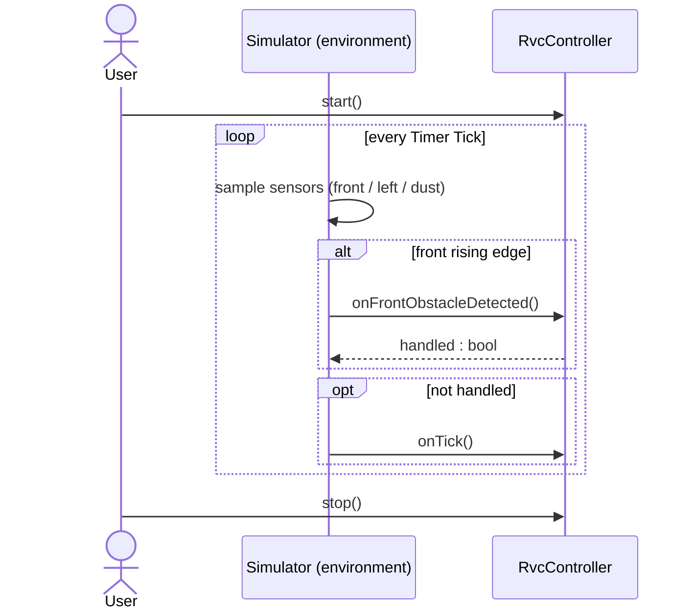

# System Operation Interface

## SRS Change Trace - 2026-06-04

### [추가]
- mermaid 시퀀스 다이어그램 추가

### [변경]
- Gated `onFrontObstacleDetected()` on controller state: it acts only while cruising (`CLEANING`/`INTENSIFYING`) and is suppressed during the avoidance sequence (`AVOIDING_OBSTACLE`, `CHECKING_RIGHT`, `ESCAPING`), so a right-scan rotation cannot raise a false interrupt that hijacks `CHECKING_RIGHT` (see failure F-10).
- Refined the simulator contract: the front obstacle interrupt fires on a clear-to-blocked edge **and only while the controller is cruising (`CLEANING`/`INTENSIFYING`)** (see failure F-10).

## SRS Change Trace - 2026-06-01

### [추가]
- Added `CHECKING_RIGHT` as the system-visible right-probe phase.
- Added edge-triggered front obstacle handling to the simulator contract.

### [삭제]
- Removed Right Sensor polling from the system operation interface.
- Removed the assumption that `onFrontObstacleDetected()` reads all side sensors immediately.

### [변경]
- Changed `onFrontObstacleDetected()` to issue `STOP` only and defer side evaluation to later `tick()` calls.
- Changed ESCAPING so each tick emits `BACKWARD` and then re-enters side evaluation.

---

## 1. Summary

| Operation | Trigger Actor | Related UC |
|---|---|---|
| `startCleaning()` | User | UC-01 |
| `tick()` | Timer | UC-02, UC-03, UC-04, UC-05 |
| `onFrontObstacleDetected()` | Front Sensor | UC-03, UC-04 |
| `stopCleaning()` | User | UC-06 |

---

## 2. System Operations

### SO-01: `startCleaning()`

Transitions the RVC from `IDLE` to `CLEANING`, sets cleaner power to `ON`, and commands `FORWARD`.

### SO-02: `tick()`

Periodic heartbeat for active behavior.

| Current State | Main Work | Possible Output |
|---|---|---|
| `CLEANING` | dust check, normal movement | `FORWARD`, optional `POWER_UP` |
| `INTENSIFYING` | countdown power-up duration | `ON` when duration expires |
| `AVOIDING_OBSTACLE` | read Left Sensor and choose left turn or right probe | `LEFT` or `RIGHT` |
| `CHECKING_RIGHT` | read Front Sensor while facing old right side | `LEFT` if blocked, otherwise resume cleaning |
| `ESCAPING` | back up one cell and re-evaluate | `BACKWARD` |

### SO-03: `onFrontObstacleDetected()`

Interrupt-based notification from Front Sensor.

Contract:
- If the system is idle, do nothing.
- [변경] Act only while cruising (`CLEANING`/`INTENSIFYING`); suppress the interrupt during the avoidance sequence (`AVOIDING_OBSTACLE`, `CHECKING_RIGHT`, `ESCAPING`), where the Front Sensor is reused for the right scan and a rotation would otherwise raise a false interrupt that hijacks `CHECKING_RIGHT` (see failure F-10). When suppressed, side evaluation continues via `tick()`.
- Otherwise issue `STOP`.
- Set state to `AVOIDING_OBSTACLE`.
- Do not perform Right Scan inside this interrupt handler; right-side probing is advanced by later `tick()` calls.

### SO-04: `stopCleaning()`

Transitions the RVC to `IDLE`, commands `STOP`, and sets cleaner power to `OFF`.

---

## 3. Right Probe Sequence

```text
onFrontObstacleDetected()
  -> STOP
  -> AVOIDING_OBSTACLE

tick()
  -> if left open: LEFT, CLEANING
  -> if left blocked: RIGHT, CHECKING_RIGHT

tick()
  -> FrontSensor detects old right side
  -> if open: CLEANING
  -> if blocked: LEFT, ESCAPING

tick()
  -> BACKWARD
  -> AVOIDING_OBSTACLE
```

---

## System Sequence Diagram



The front interrupt is accepted (`true`) only while cruising. During the avoidance sequence it returns `false`, so the Simulator falls back to `onTick()` to advance evaluation (see failure F-10).

---

## 4. Simulator Contract

- The simulator triggers front obstacle interrupt only on a clear-to-blocked edge **and only while the controller is cruising (`CLEANING`/`INTENSIFYING`)**; during the avoidance sequence the interrupt is suppressed so a right-scan rotation does not raise a false interrupt (see failure F-10). [변경]
- While front remains blocked, the controller progresses through `tick()`.
- Each simulator tick applies newly emitted motor commands and tests assert that physical movement is at most one cell.
