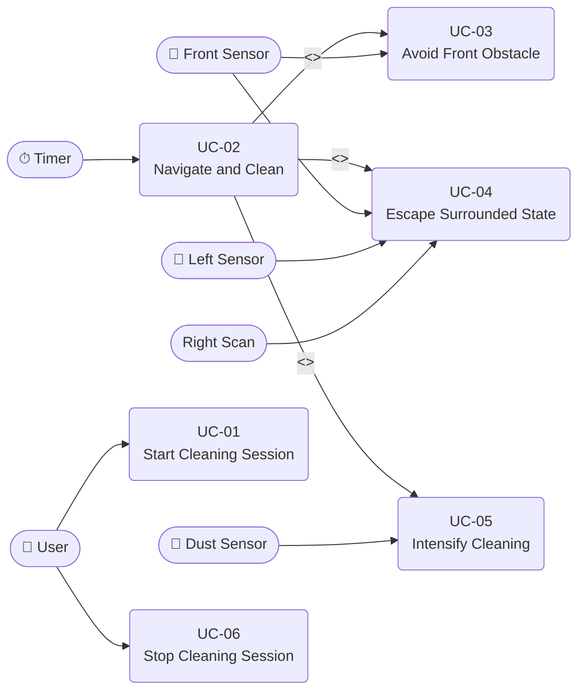

# Use-Case Model

## SRS Change Trace - 2026-05-29

### [추가]
- Added `Right Scan` as an internal behavior used by UC-03 and UC-04.
- Added tick-by-tick escape progression to UC-04.

### [삭제]
- Removed `Right Sensor` as an external actor.
- Removed single-event escape completion from UC-04.

### [변경]
- Changed right-side obstacle detection from periodic Right Sensor polling to Front Sensor right scan.
- Changed UC-04 so escape backs up one cell, then returns to side evaluation.

## 1. Actors

| Actor | Type | Description |
|---|---|---|
| User | Primary | Starts and stops a cleaning session |
| Front Sensor | External System | Detects obstacles directly ahead; interrupt-driven |
| Left Sensor | External System | Detects obstacles on the left side; periodic |
| Right Scan | Internal Control SW behavior | Checks right-side obstacles by turning right and sampling the Front Sensor |
| Dust Sensor | External System | Detects dust on the floor; periodic |
| Timer | External System | Provides periodic Tick signals to drive periodic behavior |

---

## 2. Use-Case Diagram

---

## 3. Use Cases

---

### UC-01: Start Cleaning Session

| Field | Content |
|---|---|
| **ID** | UC-01 |
| **Name** | Start Cleaning Session |
| **Primary Actor** | User |
| **Brief Description** | The user initiates a cleaning session; the RVC begins moving forward and cleaning. |
| **Preconditions** | RVC is powered on and idle. |
| **Postconditions** | RVC is in the active cleaning state, moving forward. |

**Main Success Scenario:**

1. User commands the RVC to start.
2. System activates the Cleaner (On).
3. System commands the Motor to move Forward.
4. System enters the active cleaning loop (UC-02).

---

### UC-02: Navigate and Clean

| Field | Content |
|---|---|
| **ID** | UC-02 |
| **Name** | Navigate and Clean |
| **Primary Actor** | Timer |
| **Brief Description** | On each Tick, the system evaluates sensor states and determines the next navigation and cleaning action. |
| **Preconditions** | Cleaning session is active (UC-01 completed). |
| **Postconditions** | Motor direction and cleaner state are updated for the current Tick. |

**Main Success Scenario (no obstacles, no dust):**

1. Timer fires a Tick.
2. System reads Left Sensor and Dust Sensor states; right-side status is obtained by right scan when front obstacle handling is needed.
3. All sensors report False (no obstacles, no dust).
4. System maintains Motor command: Forward.
5. System maintains Cleaner command: On.

**Alternative Flows:**

| Condition | Extension |
|---|---|
| Front Sensor fires interrupt (obstacle ahead) | → UC-03: Avoid Front Obstacle |
| Front Sensor = True AND Left Sensor = True AND Right Scan = blocked | → UC-04: Escape Surrounded State |
| Dust Sensor = True | → UC-05: Intensify Cleaning |

---

### UC-03: Avoid Front Obstacle

| Field | Content |
|---|---|
| **ID** | UC-03 |
| **Name** | Avoid Front Obstacle |
| **Primary Actor** | Front Sensor |
| **Brief Description** | When a front obstacle is detected, the RVC stops immediately. Later ticks evaluate the left side and, if needed, probe the right side by rotating and reading the Front Sensor. |
| **Preconditions** | Cleaning session is active. Front Sensor fires True. |
| **Postconditions** | RVC is moving forward on a new heading, cleaner remains On. |

**Main Success Scenario:**

1. Front Sensor triggers interrupt with True.
2. System commands Motor: Stop and enters `AVOIDING_OBSTACLE`.
3. On a later Tick, system reads Left Sensor.
4. If Left = False, system commands Motor: Left and returns to cleaning.
5. If Left = True, system commands Motor: Right and enters `CHECKING_RIGHT`.
6. On a later Tick, system reads Front Sensor as the old right side.
7. If right side is open, system resumes cleaning on the new heading.

**Alternative Flow — Both sides also blocked:**

- Step 6: Right Scan = blocked → restore original heading and transfer to UC-04.

---

### UC-04: Escape Surrounded State

| Field | Content |
|---|---|
| **ID** | UC-04 |
| **Name** | Escape Surrounded State |
| **Primary Actor** | Front Sensor, Left Sensor, Right Scan |
| **Brief Description** | When front, left, and probed right are blocked, the RVC backs up one cell and then re-evaluates the side options. |
| **Preconditions** | Cleaning session is active. Front = True AND Left = True AND Right Scan = blocked. |
| **Postconditions** | RVC is moving forward on a new heading, cleaner remains On. |

**Main Success Scenario:**

1. System detects Front = True, Left = True, and Right Scan = blocked.
2. System restores the original heading with `LEFT` and enters `ESCAPING`.
3. On the next Tick, system commands Motor: Backward.
4. System returns to `AVOIDING_OBSTACLE` and re-evaluates side options on later ticks.
5. Cleaner remains On.

---

### UC-05: Intensify Cleaning

| Field | Content |
|---|---|
| **ID** | UC-05 |
| **Name** | Intensify Cleaning |
| **Primary Actor** | Dust Sensor |
| **Brief Description** | When the dust sensor detects dust, the cleaner power is increased temporarily. |
| **Preconditions** | Cleaning session is active. Dust Sensor = True. |
| **Postconditions** | Cleaner reverts to normal power (On) after the intensification period ends. |

**Main Success Scenario:**

1. Dust Sensor reports True.
2. System commands Cleaner: Power Up.
3. System continues navigation per UC-02.
4. After the intensification duration elapses, system commands Cleaner: On (normal).

---

### UC-06: Stop Cleaning Session

| Field | Content |
|---|---|
| **ID** | UC-06 |
| **Name** | Stop Cleaning Session |
| **Primary Actor** | User |
| **Brief Description** | The user terminates the cleaning session; the RVC halts movement and turns off the cleaner. |
| **Preconditions** | Cleaning session is active. |
| **Postconditions** | RVC is idle; Motor is stopped; Cleaner is Off. |

**Main Success Scenario:**

1. User commands the RVC to stop.
2. System commands Motor: Stop.
3. System commands Cleaner: Off.
4. System exits the active cleaning loop.

